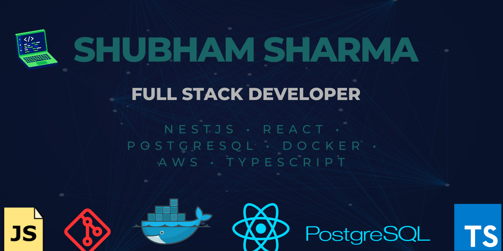

# Hi 👋 I'm Shubham Sharma

Backend Developer | Full Stack Developer

I enjoy building scalable backend systems, cloud applications, and solving DSA problems.

## 👨‍💻 About Me

🎓 B.Tech Computer Science Student

💼 Software Developer Intern @ NASSCOM

🔥 500+ DSA Problems Solved

⚡ Backend Developer

☁ Learning AWS & System Design

🚀 Open to SDE Opportunities

## 💻 Tech Stack

### Languages

### Frontend

### Backend

### Database

### DevOps & Cloud

## 📊 GitHub Stats

## 🌐 Connect With Me

## 🐍 Contribution Snake

## 👀 Profile Views

